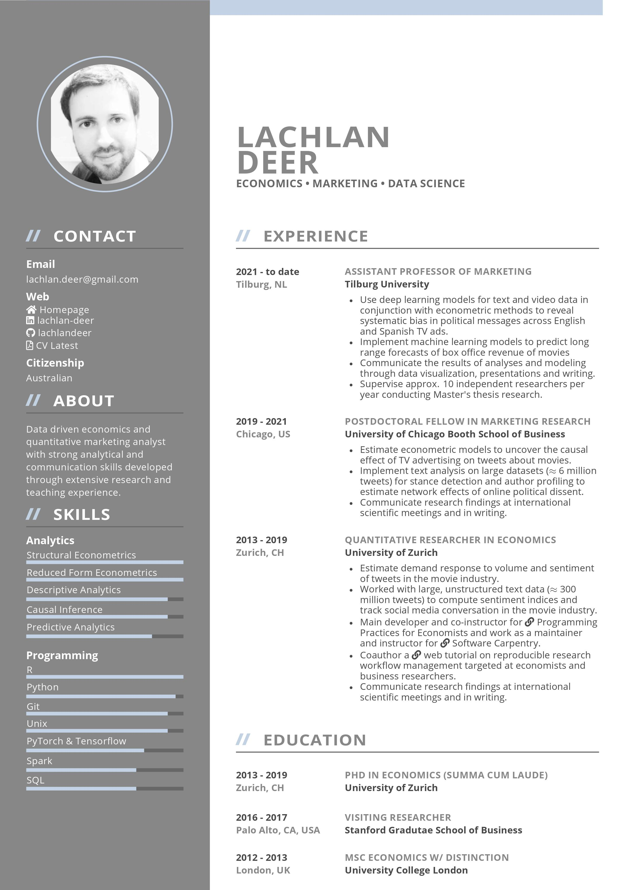

# My personal CV

**Current Version:** May 3rd 2021



## Changelog

CV is forked from [danhje/latex-resume](https://github.com/danhje/latex-resume) and modified to my liking.

Changes:

- custom accent color (thanks to [@kvalkanova](https://github.com/kvalkanova))
- adds `about` section
- adds `entrySimple` environment which allows for entries in main column without description
- adds `contactPublic` environment  to allow for public and private versions which either omit or print address and phone number
- cleans up file structure substantially
- fixes some inconsistencies in module referencing
- builds via `Make` or `Snakemake`
- Snakemake rule `cv_target` converts PDF to JPG to include as screenshot in README (requires imagekick)

## Requirements & Installation

Requirements of [danhje/latex-resume](https://github.com/danhje/latex-resume) plus `Snakemake` and `fd` if chosen to compile via `Snakemake`. `Imagekick` is required to convert PDF to JPG.

## Usage

Build CV and generate JPG for README

```
snakemake --cores all
```

CV only:

```
snakemake --cores all cv
```

Letter only:

```
snakemake --cores all letter
```

Clean LaTeX aux files after build:

```
snakemake --cores all clean
```

Clean LaTeX aux files and outputs:

```
snakemake --cores all clean_all
```

For `Make` build follow [danhje/latex-resume](https://github.com/danhje/latex-resume)

